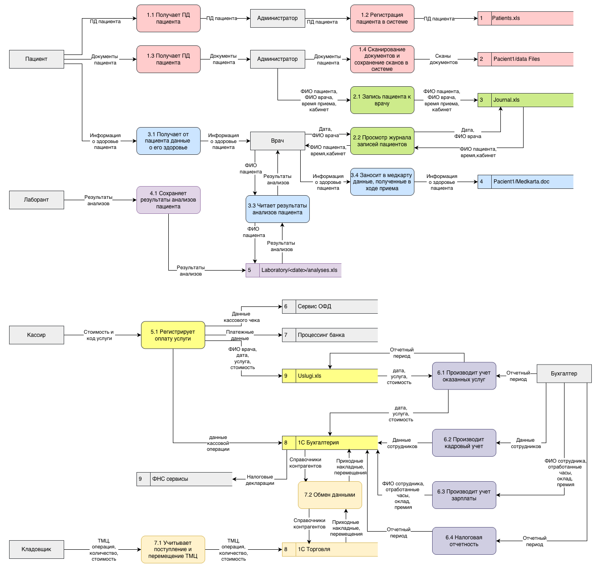
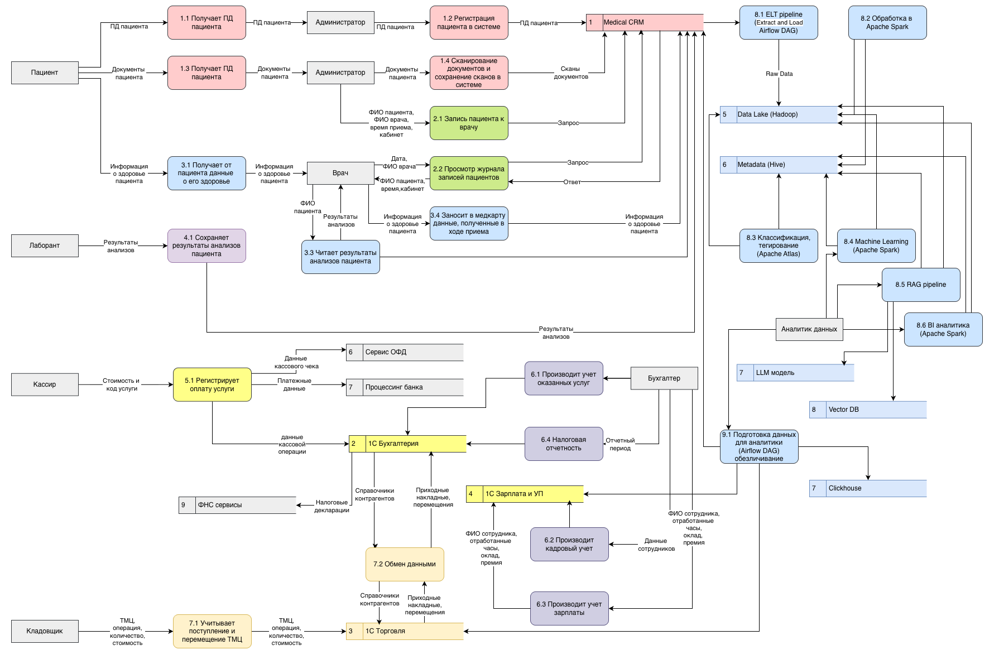

# Задание 1. Анализ безопасности системы

## Анализ безопасности As Is

### Операции

1. Регистрация пациента.
2. Запись пациента на прием к врачу.
3. Оказание медицинской услуги.
4. Оплата услуги:
    - оформление кассового чека
    - прием оплаты наличными
    - прием безналичной оплаты 
5. Регистрация результатов анализов пациента.
6. Поступление ТМЦ на склад.
7. Отгрузка ТМЦ со склада.
8. Учет услуг.
9. Кадровый учет.
10. Учет зарплаты.
11. Отчетность по налогам.

### Данные

1. Персональные данные пациентов:
   - ФИО;
   - дата рождения;
   - телефон;
   - электронная почта;
   - адрес прописки;
   - место работы или учебы.
2. Записи пациентов.
3. Платежные операции за оказанные услуги.
4. Медицинские данные пациентов:
   - записи в медкарте:
     - хронические заболевания;
     - данные, полученные в ходе приема;
     - результаты анализов;
5. Поступления денег в кассу и на счет организации.
6. Оказанные пациентам услуги.
7. Данные о поступлении, перемещении и списании ТМЦ.
8. Данные о сотрудниках.
9. Данные об оплате труда сотрудникам.
10. Данные об оплате налогов.
11. Данные о пользователях.
12. Служебная переписка сотрудников.

### Диаграммы потоков (Data Flow Diagrams)

Процессы и операции:

1. Оказание медицинской услуги:
   - регистрация пациента (1.1-1.4);
   - запись пациента на прием к врачу (2.1-2.2);
   - оказание медицинской услуги (3.1-3.4);
   - оплата услуги (5.1).
2. Обработка анализов пациента:
   - регистрация результатов анализов (4.1).
3. Учет ТМЦ на складе и в клиниках (7.1):
   - поступление ТМЦ на склад;
   - перемещение ТМЦ со склада в клинику;
   - списание ТМЦ со склада;
   - списание ТМЦ в клинике;
3. Кадровый учет (6.2):
   - прием сотрудника на работу;
   - регистрация отпусков;
   - изменение должности сотрудника;
   - подготовка и редактирование должностных инструкций сотрудников;
   - увольнение сотрудника.
4. Учет зарплаты (6.3):
   - начисление зарплаты;
   - начисление премий;
   - начисление отпускных.
5. Бухучет:
   - учет услуг (6.1);
   - подготовка налоговых деклараций (6.4)
   - отправка налоговой декларации в ФНС (6.4)

### Проблемы

1. Кроме доменной аутентификации, со стороны систем обработки нет ограничений на доступ к данным.Все данные, хранящиеся на файловых ресурсах, доступны всем аутентифицированным сотрудникам.
2. Отсутствует аудит операций с данными.
3. Отсутствует классификация данных по категориям с точки зрения конфиденциальности.
4. Базы данных хранятся на файловом сервере, доступ к ним так же не ограничен.
5. Обработка персональных и медицинских данных не соответствует законодательству, это может привести к юридическим рискам.

Маппинг процессов, данных и проблем:
|ID|Процесс|Данные или документы|Проблемы|Риски|
|--|-------|------|--------|-----|
|1.1-1.4|Регистрация пациента|ПД и сканы документов пациента|Отсутствие ограничений на доступ. Отсутствие аудита|Утечка, потеря данных, юридические и репутационные риски|
|2.1-2.2|Запись пациента на прием к врачу|Журнал записей|Отсутствие ограничений на доступ. Отсутствие аудита|Утечка, потеря данных, юридические и репутационные риски|
|3.1-3.4|Оказание медицинской услуги|Медицинская карта|Отсутствие ограничений на доступ. Отсутствие аудита|Утечка, потеря данных, юридические и репутационные риски|
|4.1|Регистрация результатов анализов|Медицинские данные|Отсутствие ограничений на доступ. Отсутствие аудита|Утечка, потеря данных, юридические и репутационные риски|
|5.1|Оплата услуги|Реестр оказанных услуг|Отсутствие ограничений на доступ. Отсутствие аудита|Утечка, потеря данных, юридические и репутационные риски|
|6.1|Учет услуг|Данные бухучета|База в файлах: отсутствие ограничений на доступ. Отсутствие аудита|Утечка, потеря данных, юридические и репутационные риски|
|6.2|Кадровый учет|Данные сотрудников|База в файлах: отсутствие ограничений на доступ. Отсутствие аудита|Утечка, потеря данных, юридические и репутационные риски|
|6.3|Учет зарплаты|Данные сотрудников|База в файлах: отсутствие ограничений на доступ. Отсутствие аудита|Утечка, потеря данных, юридические и репутационные риски|
|6.4|Отчетность по налогам|Налоговые декларации|База в файлах: отсутствие ограничений на доступ. Отсутствие аудита|Искажение данных, юридические и финансовые риски|
|7.1|Учет ТМЦ|Накладные|База в файлах: отсутствие ограничений на доступ. Отсутствие аудита|Потеря данных|

## Описание системы To Be

### Цели бизнеса в области защиты данных

Обеспечить конфиденциальность, целостность и доступность данных по следующим направлениям:

1. Интеграция лаборатории анализов с API:
   - API-контракты должны закрывать и скрывать категории данных, которые явно представляют конфиденциальные данные;
   - разграничение доступа к конфиденциальным данным;
2. Расширение направления обработки данных (новые сервисы на базе BI-, ML- и AI-технологий):
   - необходимо создать на основе файлов озеро данных, которое позволит автоматизировать построение BI, создание LLM и обучение AI на этих данных с применением ML.
3. Разработка новых систем и миграция:
   - портал для клиентов (MVP),
   - портал для сотрудников ресепшена (MVP),
   - платёжный шлюз,
   - CRM для сбора данных о клиентах,
   - интеграцию с лабораторией анализов.
4. Определить категории данных пациентов и разнести их по различным доменам. Для каждой категории данных определить роли (RBAC) или атрибуты (ABAC), на основании которых сотрудникам будет разрешён доступ к данным (MVP).

### Финальное состояние (через год)

1. Полностью автоматический процесс записи к специалисту через портал и мобильное приложение.
2. Пациенту приходят оповещения о записи через мобильное приложение или голосового робота. В ответ на оповещение клиент может подтвердить или отменить запись, при этом система отправляет оповещение на ресепшен. 
3. В мобильном приложении пациент может просматривать только свои данные (анализы, заключения, договор), у него нет доступа к данным других пациентов. 
4. В системе есть возможность помечать тегами данные, которые необходимо защитить.
5. Релиз проверяется в автоматическом режиме на работу с тегированными данными, после чего информация передаётся в систему мониторинга и алертинга.
6. В системе появилась возможность проводить аудит доступа к данным и отслеживать нетипичные действия пользователей.
7. В случае несанкционированного доступа к данным команде приходят оповещения.

### Нефункциональные требования

1. Безопасность (конфиденциальность). Необходима гарантия того, что чувствительная информация будет безопасно храниться и обрабатываться. Чувствительные данные важно своевременно удалять. Если клиент обратится с соответствующим запросом, обработку его данных нужно прекратить.
2. Масштабируемость. Система должна стабильно работать в условиях расширения бизнеса: компания открывает филиалы, нанимает десятки сотрудников и даёт клиентам возможность работать через мобильное приложение.
3. Сопровождаемость. Нужно предусмотреть внесение изменений и улучшений в систему. Этот процесс должен быть простым и понятным.
4. Конфигурируемость. В конфигурации можно вносить изменения без дополнительных доработок.

### Меры по защите данных

Используем следующие подходы:

1. Privacy By Design - сначала прорабатываем меры по защите данных и только после этого начинаем разработку систем.
2. Data Minimization - в обработке используются только минимально необходимые данные.
3. Data Lineage - отслеживаем полный путь данных.

Защищаемые данные:

|Данные|Шифрование|Обфускация|Обезличивание|
|------|----------|----------|-------------|
|ПД пациентов|+|||
|Медицинские данные пациентов|+|||
|Записи пациентов|+||+ (для аналитики)|
|Платежные операции|+|+ (для обработки)||
|Кассовые операции|+|+ (для обработки)||
|Оказанные услуги|+||+ (для аналитики)|
|Складские операции|+||+ (для аналитики)|
|ПД сотрудников|+|||
|Зарплата сотрудников|+||+ (для аналитики)|
|Налоговая отчетность организации|+|||
|Учетные данные сотрулников|+|||
|Служебная переписка|+|||

Резюме:
1. Все хранимые данные должны быть зашифрованы во избежании утечки.
2. Во время обработки или передачи данных, расшифрованные данные лучше обфусцировать, например для платежных данных или кассовых операций подойдет токенизация.
3. Если данные нужны для составления аналитических отчетов, рашифрованные данные следует обезличить (маскировать).

### Механизм тегирования данных

Предпочтительно использование стандартного функционала уже сертифицированных в соответствии с законодательством решений. Например, программа «1С:Зарплата и управление персоналом» соответствует требованиям Федерального закона от 27 июля 2006 года №152-ФЗ «О защите персональных данных».

При самостоятельной разработке систем, механизм тегирования должен соответствовать следующим требованиям:
1. Присвоение тегов уже на этапе проектрирования структуры БД:
   - Следующие поля ПД пациента должны быть помечены тегом "PD" (персональные данные):
      - ФИО;
      - дата рождения;
      - телефон;
      - электронная почта;
      - адрес прописки;
      - место работы или учебы.
   - Аналогично должны помечаться тегом "PD" поля ПД сотрудников.
   - Все поля медицинской карты должны быть помечены тегом "MD" (медицинские данные).
   - Результаты анализов также должны быть  помечены тегом "MD".
   - Платежные данные должны быть помечены тегом "CD" (конфиденциальные данные).
   - Данные, относящиеся к бизнес-операциям (услуги) и переписка помечаются тегом "ID" (internal - внутренние данные).

2. При устаревании информации автоматически должны добавляться теги "AD" (архивные данные) для автоматического перемещения в хранилище для долгосрочного хранения.

3. При подготовке данных для аналитики на разных этапах пайплайна ETL должны проставляться следующие теги:
   - сырые неочищенные данные помечаются тегом "RD" (raw data) для того, чтобы:
      - данные с персональной или конфиденциальной информацией не попали в аналитическу выборку;
      - было проведено обезличивание данных, убирается тег "RD", ставится тег "DP" (depersonalized).
   - например для данных лабораторных анализов можно использовать расширенный набор тегов:
      - "raw" - сырые данные;
      - "verificated" - верифицированные данные;
      - "depersonalized" - деперсонализированные данные;
      - "cleaned" - очищенные данные (готовые для аналитики).

### Выводы

Для защиты конфиденциальности данных необходимо:

1. Переработать архитектуру системы, чтобы данные хранились в БД, а не в офисных документах.
2. Использовать подходы:
   - Privacy By Design - сначала прорабатываем меры по защите данных и только после этого начинаем разработку систем.
   - Data Minimization - в обработке используются только минимально необходимые данные.
   - Data Lineage - отслеживаем полный путь данных. 

3. В соответствии с подходом Privacy By Design:

   - По-возможности использовать готовые программные решения, соответствующие требованиям законодательства в области защиты данных, например, программа «1С:Зарплата и управление персоналом» соответствует требованиям Федерального закона от 27 июля 2006 года №152-ФЗ «О защите персональных данных».

   Для самостоятельно разрабатываемых систем:

   - Классифицировать данные по уровню конфиденциальности:
      - публичные
      - внутренние
      - конфиденциальные
      - персональные
      - медицинские
   - Присвоить теги уже на этапе проектрирования структуры БД.
   - Настроить разграничение доступа к файлам и БД на основе RBAC или ABAC и с учетом классификации данных.

4. В соответствии с подходом Data Minimization исключить из обработки избыточные данные.

5. В соответствии с подходом Data Lineage отслеживать происхождение и путь данных. Для этого иcпользовать присваивать разные теги в зависимости от этапов обработки данных, например:
   - При устаревании информации автоматически должны добавляться теги "AD" (архивные данные) для автоматического перемещения в хранилище для долгосрочного хранения.

   - При подготовке данных для аналитики на разных этапах пайплайна ETL должны проставляться следующие теги:
      - сырые неочищенные данные помечаются тегом "RD" (raw data) для того, чтобы:
         - данные с персональной или конфиденциальной информацией не попали в аналитическу выборку;
         - было проведено обезличивание данных, убирается тег "RD", ставится тег "DP" (depersonalized).
      - например для данных лабораторных анализов можно использовать расширенный набор тегов:
         - "raw" - сырые данные;
         - "verificated" - верифицированные данные;
         - "depersonalized" - деперсонализированные данные;
         - "cleaned" - очищенные данные (готовые для аналитики).

   - Для данных аналитики можно использовать инструменты управления метаданными, например Open Source решение Apache Atlas, которое:
     - обеспечивает автоматическое обнаружение, классификацию и визуализацию потоков данных. Например, если данные из HDFS обрабатываются в Apache Spark и записываются в Hive, Atlas покажет весь путь данных, от источника до конечного использования, в соответствии с подходом Data Lineage.
     - позволяет настроить политики доступа, например, предоставляя гибкий доступ в зависимости от установленного тега.

Диаграмма потока To Be:

## UPDATE: Технологии защиты я расписывал в [task3/DECISION.md](task3/DECISION.md) согласно требованиям задания, дублирую с дополнениями

Инструменты защиты:
|Метод защиты|Инструмент защиты|Примечание|
|------------|-----------------|----------|
|Минимизация данных|нет|Инструмента нет, выполняется вручную на этапе проектирования системы|
|Шифрование на уровне ФС|Bitlocker|Функционал Windows Server|
|Ограничение доступа к БД|Безопасность NTFS, AD, Firewall, RBAC в СУБД|Функционал Windows Server|
|Аудит|Встроен в CRM и в 1С|Требуется добавить функционал, если CRM будет собственной разработки|
|Резервное копирование БД|Встроен в СУБД||
|Резервное копирование файлов|Acronis Backup|Один из вариантов, самый функциональный, но можно использовать бесплатные решения или скрипты собственной разработки|
|Обезличивание|PostgreSQL Anonymizer |Один из вариантов, есть платные решения https://www.red-gate.com/products/data-masker/ или Attacama One, можно самостоятельно реализовать|
|Обфускация|Штатная обработка «Скрытие конфиденциальной информации»|Для решений на базе 1С|
|Защита учетных данных пользователей домена|Шифрование базы NTDS на уровне ОС, ограничение доступа, шифрование дисков, резервный контроллер домена, зашифрованные протоколы передачи, ВПН|Штатный функционал Windows Server|
Дополнения:
|Шифрование at rest БД|pgcrypto|PostgreSQL, шифрование отдельных столбцов, шифрование паролей, хэширование|
|Обфускация на уровне БД|pgcrypto|PostgreSQL, функция gen_random_bytes для создания криптографически безопасных случайных последовательностей|
|Шифрование in transit|HTTPS (TLS 1.3)|Все каналы передачи данных|
|Шифрование на уровне приложения|ALE - Application-level encryption (AES-256)||
|Шифрование токенов|JWE||

