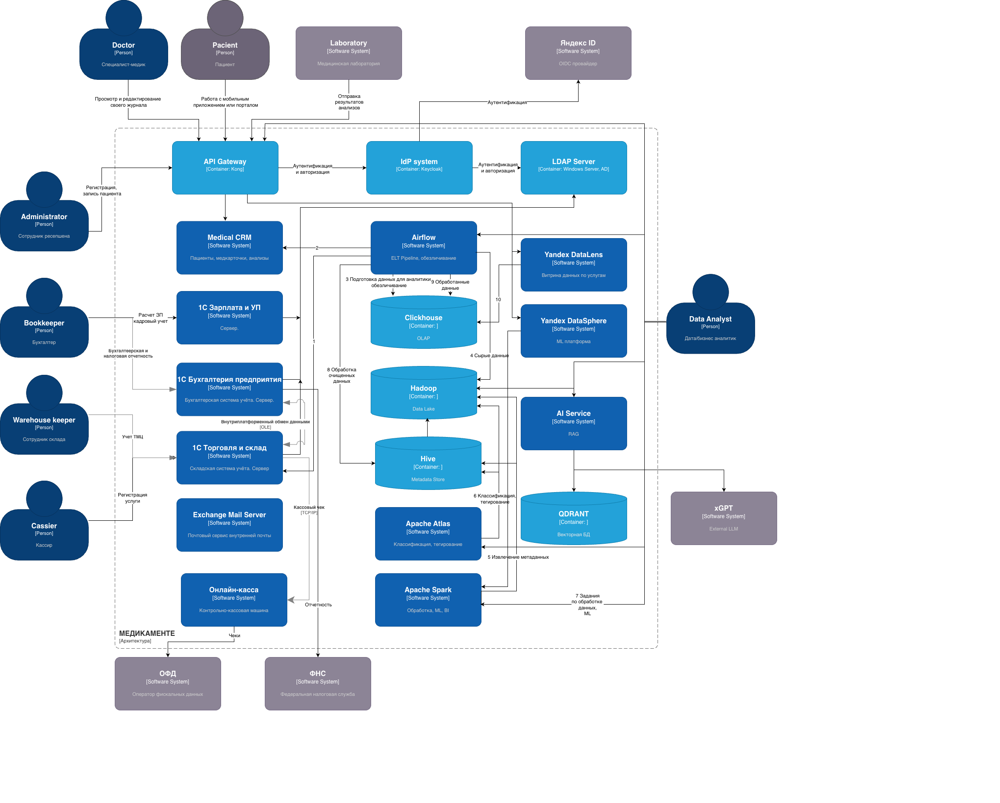

# Задание 2. Проектирование решения

Диаграмма контекста C4 целевого состояния системы:

## Целевая архитектура системы

1. Поскольку в компании уже сложились бизнес процессы, использующие программные продукты компании 1С, принято решение их оставить, тем более, что они соотвтетствуют требованиям Федерального закона от 27 июля 2006 года  № 152-ФЗ «О защите персональных данных». Речь идет о 1С:Бухгалтерии и 1С:Торговля и склад.
2. Для учета зарплаты и кадрового учета добавил также 1С:Зарплата и управление персоналом, что закроет вопрос с защитой ПД сотрудников.
3. Все программы линейки 1С должны быть переведены с файлового на клиент-серверный вариант для улучшения производительности и лучшей защиты данных. Серверный вариант также потребует установку поддерживаемой СУБД. Поскольку это диаграмма контекста, сервер БД я не изображаю на схеме.
4. ККМ будет заменена онлайн-кассой для соответствия реалиям, направление взаимодействия будет изменено, кассир будет работать через интерфейс 1С Торговли, чеки будут отправляться из 1С в онлайн-кассу и далее в ОФД. Для подключения кассы к 1С есть стандартные обработки от 1С и драйвера от производителей касс, тот же АТОЛЛ.
5. Налоговая отчетность будет отправляться из 1С Бухггалтерии через модуль 1С:Отчетность.
6. Все данные, хранящиеся на файловом сервере в форматах офисных файлов, а также сканы документов будут храниться в БД и обрабатываться Medical CRM. Это позволит скрыть данные от пользователей, доступ к данным будет ограничен по модели RBAC или ABAC средствами Medical CRM. Сканы будут храниться как внешние файлы, доступ к ним будет закрыт для всех пользователей, кроме администраторов.
7. Medical CRM согласно требованиям заказчика будет включать следующие модули:
- Клиентский портал (веб-интерфейс);
- Мобильное приложение для пациентов;
- Портал для сотрудников (администраторы ресепшен, врачи), собственно CRM (веб интерфейс или толстый клиент);
- API Gateway
- Backend (API сервисы)
- Платежный шлюз
- Интеграция с лабораториев (прием результатов анализов);
8. С учетом состава модулей, рассматриваются 2 варианта реализации системы:
- микросервисная архитектура с самостоятельной разработкой всех модулей;
- учитывая, что в компании уже используются решения на базе 1С, есть смысл рассмотреть вариант использования готовой конфигурации CRM на базе 1С с возможностью ее доработки под задачи компании, скорее всего есть готовая конфигурация для медицинских клиник;
- можно приобрести комплексное решение от 1С из класса ERP систем, собственно 1С:ERP Управление предприятием, и его доработать под специфику бизнеса. 1С:ERP Управление предприятием заменит 1С Торговлю, 1С ЗиУП и 1С Бухгалтерию. В этом случае часть функциональности все равно придется разрабатывать самостоятельно как интеграцию с 1C ERP. Но мы получим одну систему "единого окна" с общим интерфейсом для всех сотрудников, а не 4 разные программы.
9. Exchange Mail Server и AD на базе Microsoft Windows Server можно оставить, если уже куплены лицензии. С точки зрения защиты данных эти системы не требуют замены.

## Архитектура подсистемы обработки данных

Компоненты этой подсистемы на схеме C4 изображены подробнее. Для полноты картины я не стал изображать их на отдельной схеме, а добавил к диаграмме контекста С4.

### Компоненты

1. Hadoop и Hive используются в качестве Data Lake (Озера данных). Изначально в Data Lake сохранятся сырые данные, далее данные проходят через несколько этапов трансформации, промежуточные обработанные данные сохраняются здесь же в Data Lake, окончательно обработанные данные выгружаются в ClickHouse. Аналитики получают к ним доступ через витрину данных.
2. Airflow используется для выполнения следующих процессов:
    - ELT - загрузка из CRM в медицинских данных сыром виде, для последующей обработки, данные в процессе загрузки обезличиваются;
    - сразу загрузка в Clickhouse из 1С и CRM и обработка данных по услугам;
    - загрузка очищенных и протегированных данных (с использованием Apache Spark и Atlas) в Clickhouse;
3. Apache Spark - используется для:
    - очистки и обработки сырых данных, в результате формируется база метаданных Hive;
    - машинного обучения с использованием библиотеки MLLib, модель сохраняется здесь же в Hadoop Data Lake;
4. Apache Atlas используется для классификации и тегирования данных. Как вариант можно использовать Informatica BDE (Big Data Edition), с ее помощью можно проследить Data Lineage, но это решение платное и достаточно дорогое;
5. AI Service и QDRANT - система реализующая RAG на базе модели из обработанных данных в Data Lake и данных ML-модели, данные векторизуются и сохраняются в векторной БД QDRANT;
6. Yandex DataLens - витрина данных, для более продвинутой обработки можно использовать Yandex DataSphere.

### Последовательность обработки данных

1. Первичное накопление оперативной информации в БД CRM и 1С;
2. Airflow RAG: данные по услугам из 1С и CRM сразу (с обработкой и обезличиванием) загружаются в OLAP на базе Clickhouse (3 на схеме);
   Далее описана обработка медицинских данных:
3. Airflow RAG: ELT (или ETL) пайплайн по формированию первого слоя сырых данных Data Lake (CRM -> Hadoop) (1-2, 4 на схеме);
4. Apache Spark: извлечение метаданных (Hadoop -> Hive) (5 на схеме);
5. Apache Atlas: классификация и тегирование (Hadoop/Hive) (6 на схеме);
6. Apache Spark: Machine learning (Hadoop/Hive) (7 на схеме);
7. Airflow RAG: загрузка очищенных данных в Clickhouse (8-9 на схеме);
8. Yandex DataLens: визуализация с использованием подготовленных данных и готовых дашбордов;
9. Yandex DataSphere: интеграция с Apache Spark и выполнение произвольных задач по аналитической обработке и машинному обучению. 
