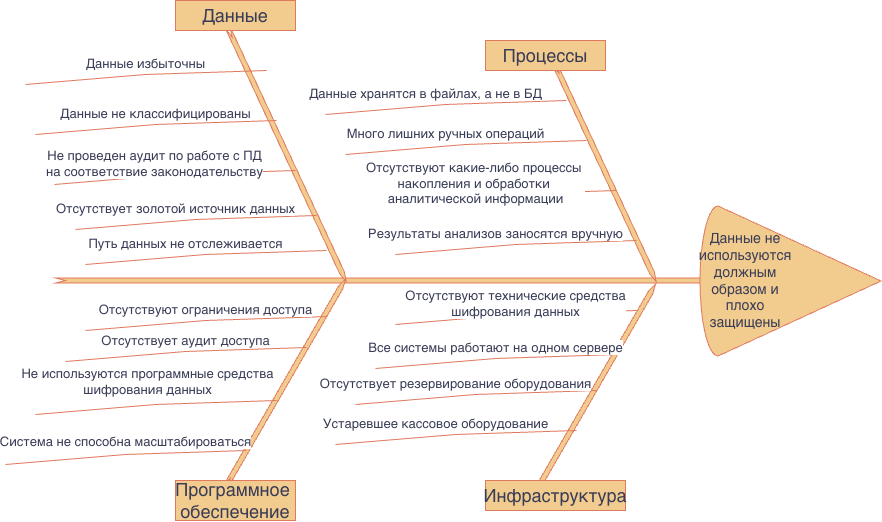

# Задание 4. Оценка узких мест при миграции

## Цели миграции

1. Интеграция лаборатории анализов с API (но никакого API нет тоже).
2. Расширение направления обработки данных (обработки данных тоже не вижу).
3. Разработка новых систем:
- портал для клиентов,
- портал для сотрудников ресепшена,
- платёжный шлюз,
- CRM для сбора данных о клиентах,
- интеграцию с лабораторией анализов.
4. Разработка мобильного приложения.
5. Классификация и тегирование данных.
6. Релиз проверяется в автоматическом режиме на работу с тегированными данными, после чего информация передаётся в систему мониторинга и алертинга.
7. В системе появилась возможность проводить аудит доступа к данным и отслеживать нетипичные действия пользователей. В случае несанкционированного доступа к данным команде приходят оповещения.

## Ключевые процессы и компоненты, затрагиваемые миграцией

### Процессы

1. Регистрация пациента.
2. Запись пациента на прием к врачу.
3. Оказание медицинской услуги.
4. Оплата услуги:
    - оформление кассового чека
    - прием оплаты наличными
    - прием безналичной оплаты 
5. Регистрация результатов анализов пациента.
6. Учет услуг.
7. Кадровый учет.
8. Учет зарплаты.
9. Отчетность по налогам.

### Компоненты

1. Файловый сервер.
2. 1C: Бухгалтерия.
3. 1C: Торговля.
4. ККМ.

## Диаграмма Исикавы

Для структурного анализа узких мест удобно использовать диаграмму Исикавы:

## Список мер по устранению узких мест

Данные:

1. Применение подхода Privacy By Design.
2. Минимизация данных.
3. Классификация данных.
4. Использование готовых сертифицированных по 152 ФЗ программных решений, например, 1С.
5. Формироввние золотого источника данных.
6. Тегирование данных, применение решений по обработке данных, которые позволяют отслеживание путь данных.
7. Обфускация и обезличивание данных.

Процессы:

1. Хранение данных в БД, использование СУБД.
2. Внедрение CRM для исключения ручных операций.
3. Внедрение процесов накопления и обработки аналитической информации.
4. Использование ML и AI в аналитике данных.
5. Интеграция с лабораторией.

Программное обеспечение:

1. Реализация RBAC или ABAC для ограничения доступа к данным.
2. Реализация аудита доступа.
3. Использование шифрования хранящихся и передаваемых данных.
4. Реализация возможности масштабирования системы.
5. Замена файлового варианта 1С серверным.

Инфраструктура:

1. Использование средств шифрования.
2. Использование отдельных серверов для разных задач.
3. Резервирование серверного оборудования.
4. Замена ККМ современными онлайн-кассами.

Приоритетность согласно очередности выше, то есть:
1. Все, что касается данных (Privacy by Design).
2. Проектируем безопасные и оптимальные процессы.
3. Реализуем ПО согласно спроектированным процессам (пока без аналитики).
4. Улучшаем инфраструктуру (оборудование можно приобрести ближе к приемочным испытаниям).
5. Реализуем направления обработки данных (последний приоритет - потребует много железа, финансовых и человеческих ресурсов).