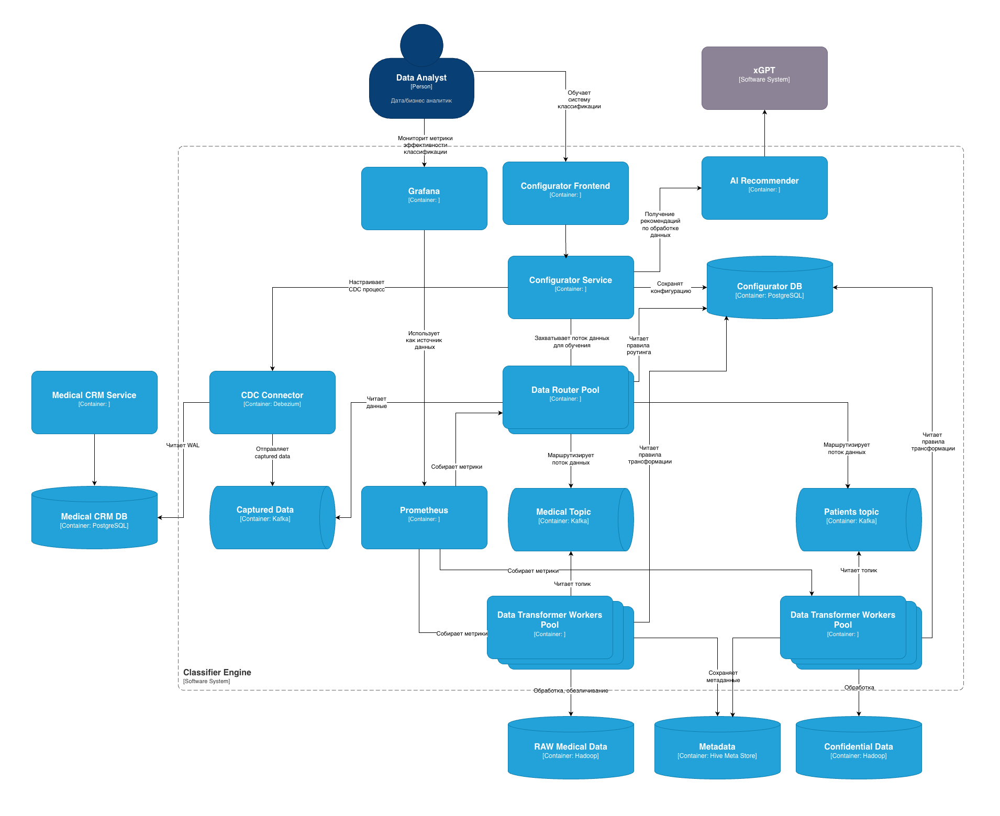

# Задание 6. Классификация данных

## Спроектируйте движок для классификации данных

*Спроектируйте движок для классификации данных перед их пакетной загрузкой в аналитическое хранилище данных. При проектировании не забудьте учесть, что структуры данных на входе в хранилище подвержены структурным изменениям и не размечены на предмет того, к какому классу конфиденциальности относятся.*

Диаграмма С4 контейнеров спроектированного решения:

Компоненты Classifier Engine:
1. Configurator - служит для обучения движка классификации, хранит конфигурацию классификации и трансформации данных, настраивает CDC-connector.
2. AI Recommender - предлагает рекомендации по классификации данных с использованием LLM.
3. CDC Connector - поставляет изменения в БД (на основе Debezium).
4. Captured Data - топик для захваченных данных (Apache Kafka).
5. Data Router - маршрутизирует данные разных типов соответствующим Data Transformers
6. Mediacal Topics, Patients topics - топики для данных разных типов (Apache Kafka).
7. Data Transformer - выполняет обработку данных, если надо, выполняет обезличивание, обфускацию, генерирует метаданные.
8. Хранилища данных, так как по нашему кейсу это Data Lake, используем Hadoop для разных слоев данных и Hive для метаданных.
9. Prometheus и Grafana - визуализация и мониторинг метрик эффективности классификации данных.

## Организация данных разного уровня конфиденциальности

*В хранилище данных тем не менее будут частично храниться данные, которые можно отнести к конфиденциальным. Поэтому необходимо предложить проектное решение по организации специального слоя/нескольких слоёв в хранилище данных, учитывающее эту особенность. Обратите внимание, кроме слоёв можно предложить и другие меры.*

Данные разного уровня конфиденциальности хранятся в одном Data Lake, тип данных по конфиденциальности определяется соответствующими метаданными, хранящимися в Hive Metastore, дополнительно можно использовать теги.

## Оценка эффективности классификации данных

*Ответить на вопросы, какие метрики вы будете использовать для оценки эффективности классификации данных и как это поможет в процессе оптимизации системы.*

Для оценки эффективности классификации данных будут использоваться следующие метрики:
- количество сообщений в топиках
- скорость обработки сообщений
- поток захваченных сообщений

## Масштабирование системы

*Подумать о том, как будет обеспечена scalability системы и как вы планируете расширить систему при увеличении объёма данных или количества пользователей.*

Apache Kafka отлично масштабируется, поэтому используем ее.

Рекомендуется использовать Kubernetes в качестве платформы для Сlassifier Engine.
В этом случае будет обеспечена масштабируемость следующих компонент движка:
- Data Router -> Data Routers Pool
- Data Transformer -> Data Transformers Pool (каждого типа).

Используя функционал кастомных метрик, можно настроить Horizontal Pod Autoscaler для указанных масштабируемых компонентов.

